<div align="center">



<br/>


<br/><br/>


&nbsp;
<a href="https://github.com/Arijit-Clowny"></a>
&nbsp;
<a href="https://github.com/Arijit-Clowny"></a>

</div>

<br/>

<!-- ══════════════════════════════════════════════════════════ -->
<!--                      ABOUT ME                               -->
<!-- ══════════════════════════════════════════════════════════ -->

<h3 align="center">🧑‍💻 About Me</h3>


I'm a Computer Science undergraduate with a solid base in **Java, Python, C, SQL,** and **Data Structures & Algorithms**. I enjoy turning problems into clean, working code — including hands-on experience building a **full desktop application in Python**. Right now I'm sharpening my **Java** skills for backend/application development while steadily building toward a focus in **Data Science and Machine Learning**, aiming to apply analytical and programming skills to real-world, data-driven problems.

```python
class ArijitShaw:
    def __init__(self):
        self.name        = "Arijit Shaw"
        self.role         = "CS Undergraduate | Aspiring AI/ML & Data Science Engineer"
        self.location    = "Nadia, West Bengal, India"
        self.education   = "B.Tech CSE — NSHM Knowledge Campus (5th Sem, CGPA: 7.9)"
        self.languages   = ["English", "Hindi", "Bengali"]
        self.focus       = ["DSA", "OOP", "Data Science", "Machine Learning"]
        self.currently   = "Deepening Java for backend dev, building toward AI/ML"
        self.looking_for = "Internships & entry-level roles in SDE / AI-ML"

    def say_hi(self):
        print("Thanks for stopping by — let's build something cool together! 🚀")

me = ArijitShaw()
me.say_hi()
```

<br clear="right"/>


<!-- ══════════════════════════════════════════════════════════ -->
<!--                      TECH STACK                             -->
<!-- ══════════════════════════════════════════════════════════ -->

<h3 align="center">🛠️ Tech Stack</h3>

<div align="center">


<br/><br/>


</div>

<br/>


<!-- ══════════════════════════════════════════════════════════ -->
<!--                      GITHUB STATS                            -->
<!-- ══════════════════════════════════════════════════════════ -->

<h3 align="center">📊 GitHub Analytics</h3>

<div align="center">


</div>
<br/>


<!-- ══════════════════════════════════════════════════════════ -->
<!--                      EDUCATION                               -->
<!-- ══════════════════════════════════════════════════════════ -->

<h3 align="center">🎓 Education</h3>

<div align="center">

**B.Tech — Computer Science & Engineering**
NSHM Knowledge Campus · Current CGPA: **7.9** · 5th Semester

**Senior Secondary (Class XII) — CBSE**
DAV Model School, Durgapur · Aggregate: **75.4%** · 2024

**Secondary (Class X) — ICSE**
St. Michael's School, Durgapur · Aggregate: **83.4%** (best of 5) · 2022

</div>

<br/>


<!-- ══════════════════════════════════════════════════════════ -->
<!--                      CONNECT                                 -->
<!-- ══════════════════════════════════════════════════════════ -->

<h3 align="center">📫 Let's Connect</h3>

<div align="center">

<a href="mailto:arijitshaw2112@gmail.com"></a>
<a href="https://www.linkedin.com/in/arijit-shaw-81a5803b1"></a>
<a href="https://github.com/Arijit-Clowny"></a>

<br/><br/>

<i>"Turning problems into clean, working code — one commit at a time."</i>

</div>


